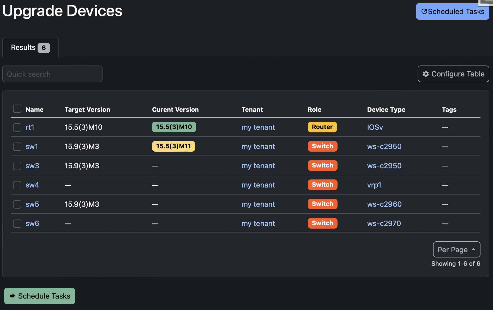
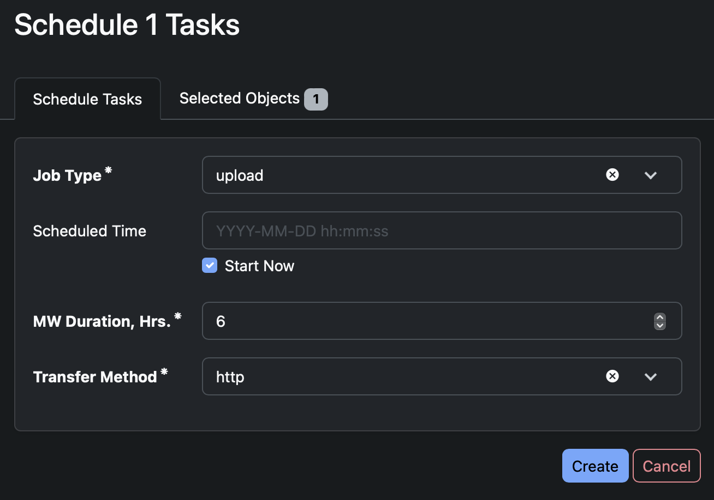

# Software Manager - NetBox plugin

[NetBox](https://github.com/netbox-community/netbox) plugin to manage software for your Cisco devices in following aspects:
- software repository (download does not work after Gunicorn was changed to nginx-unit, trying to manage with it)
- assign target (golden) image on created Device Types
- get software version compliance report for every device in Excel format
- scheduled upload golden image on devices
- scheduled reload devices with golden image

## Important notes

1. Compatible with NetBox 2.9 and higher versions only.
2. Plugin works with standalone IOS/IOS-XE boxes only. No Stacks/VSS/StackWiseVirtual at present.
3. Plugin operates with software version only, and does not consider feature set (lanlite vs lanbase, K9 vs NPE).
4. Test in your local sandbox, do not jump to production network.
5. Use this plugin on production network at one's own risk with take responsibility for any potential outages due to reload of devices.

## Software Repository

### Main page


### Add/Edit software page


Select *.bin file, specify expected MD5 (from cisco site) and verbose version. Plugin calculates MD5 when file uploading and result should matches with entered MD5, otherwise MD5 will be redded.

## Golden Images

### Main page


Assigned Image/Version for all created DeviceTypes with upgrade progress for particular DeviceType. "Export" button provides detailed Excel report.

## Upgrade Devices

### Main page



provides information about Target/Current versions (green = match, yellow = upgrade is required)
<!-- - allows filter out devices based on few attributes
- way to create shedeled task for selected devices -->

### Add scheduled task



- Select job type:
    - upload (transfer golden image to the box)
    - upgrade (reload with golden image w/o transfer)
- select time to start or set "Start Now". Time is based on NetBox TimeZone, not your browser/hostPC.
- select MW duration. All tasks will be skipped after this time (countdown starts from scheduled time, not from time of creation tasks)

### Scheduled tasks list


List of all scheduled/completed tasks.

> Tasks with Running status can be deleted in admin view only.

> Plugin has acknowledgment logic to try to prevent mass outage. ACK flag become True only in case of getting expected result. In case of any unknown error/traceback job will be finished with ACK=False. Any new job checks number of non-ACK and can be skpped if this number crossed threshold. ACK flag can be changed manually by clicking on "V" or "X".

### Scheduled tasks info


Detailed information about task and execution log.

# Installation

Instruction below describes installation for Docker-compose instance of NetBox.

For bare-metal setup pip can be used for installation. But some changes (ftp/redis etc) will be requared anyway.
```shell
pip install netbox-plugin-software-manager
```

## 1. Create new docker image based on latest-ldap netbox image

```shell
cd {{ your-netbox-locaton }}
git clone https://github.com/alsigna/netbox-software-manager.git
cd netbox-software-manager
docker build -t netbox-plugin .
```
> Dockerfile:
>
> ```dockerfile
> FROM netboxcommunity/netbox:latest-ldap
>
> # install scrapli[paramiko], rq-scheduler, xlsxwriter
> COPY requirements.txt /requirements.txt
> RUN /opt/netbox/venv/bin/python -m pip install -r /requirements.txt
>
> # make folder for image location. Shold be in django media folder
> # folder name (software-images in example) is used as FTP username and should be copied to NetBox configuration.py file. Remember this name.
> RUN mkdir /opt/netbox/netbox/media/software-images/
> RUN chown -R unit:unit /opt/netbox/netbox/media/software-images
>
> # Add additional queue (software_manager in example). This name should be copied to NetBox configuration.py. Remember this name.
> RUN echo $'\n\
> RQ_QUEUES["software_manager"]=RQ_PARAMS\n\
> ' >> /opt/netbox/netbox/netbox/settings.py
> 
> # Install plugin from local repository
> #--SoftwareManager
> COPY ./software_manager/ /source/SoftwareManager/software_manager/
> COPY ./setup.py /source/SoftwareManager/
> COPY ./README.md /source/SoftwareManager/
> COPY ./MANIFEST.in /source/SoftwareManager/
> 
> #--Pip
> RUN /opt/netbox/venv/bin/python -m pip install /source/SoftwareManager/

## 2. Create FTP docker image based on [docker-alpine-ftp-server](https://github.com/delfer/docker-alpine-ftp-server)

>Why FTP? Originally scp was used to transfer files, but based on experience, FTP is much faster.

>HTTP was added in 0.0.3, But FTP_USERNAME in configuration still required as it used as folder name for IOS upload

```shell
cd ftp
docker build -t ftp_for_netbox .
cd ../../
```
or
```shell
cd http
docker build -t http_for_netbox .
cd ../../
```
## 3. Change docker-compose.yml

```dockerfile
...
  netbox-server: &netbox-server
    # Change image name to "customized" image from step 1.
    image: netbox-plugin
    volumes:
      # Mount log file. Path have to match with specified in configuration.py
      - ./netbox-software-manager/upgrade.log:/var/log/upgrade.log:z
      # Replace nginx-unit config
      - ./netbox-software-manager/nginx-unit.json:/etc/unit/nginx-unit.json:z,ro
      # Mount folder with IOS images. NetBox will upload/delete images.
      # Format: /opt/netbox/netbox/media/{{ FTP_SERVER_USRNAME}}
      - ./netbox-software-manager/software-images:/opt/netbox/netbox/media/software-images:z
      # Mount script for rq
      - ./netbox-software-manager/rq.sh:/etc/netbox/rq.sh:z,ro
...

  netbox-worker:
    # Run script instead of single worker
    command: /bin/bash /etc/netbox/rq.sh
    # Comment original config:
    # entrypoint:
    # - /opt/netbox/venv/bin/python
    # - /opt/netbox/netbox/manage.py
    # command:
    # - rqworker 
...

  # FTP server from step 2.
  ftp:
    image: ftp_for_netbox
    ports:
      - "21:21"
      - "21000-21100:21000-21100"
    privileged: true
    volumes:
      # Mount folder with IOS images. FTP has RO only.
      - ./netbox-software-manager/software-images:/ftp/software-images:z,ro
      # Mount configuration files
      - ./netbox-software-manager/ftp/start_vsftpd.sh:/etc/vsftpd/start_vsftpd.sh:z,ro
      - ./netbox-software-manager/ftp/vsftpd.conf:/etc/vsftpd/vsftpd.conf:z,ro
    entrypoint: /etc/vsftpd/start_vsftpd.sh
    environment:
      # Specify user/password
      - USERS=software-images|ftp_password
      # Your external (host) IP address, not contaner's IP
      - ADDRESS=192.168.0.1
  
  # simple http server
  http:
    image: http_for_netbox
    ports:
      - "80:80"
    volumes:
      # Mount folder with IOS images. FTP has RO only.
      - ./netbox-software-manager/software-images:/usr/share/nginx/html:z,ro

```

## 4. Change NetBox configuration.py

```python
PLUGINS = [
    'software_manager',
]

PLUGINS_CONFIG = {
    'software_manager': {
        # Device credentials
        'DEVICE_USERNAME': 'cisco',
        'DEVICE_PASSWORD': 'cisco',
        # FTP credentials
        'FTP_USERNAME': 'software-images',
        'FTP_PASSWORD': 'ftp_password',
        'FTP_SERVER': '192.168.0.1',
        # HTTP server name with patch to images
        "HTTP_SERVER": "http://192.168.0./",
        # Default transport method, can be also changed while scheduling task, [tfp|http]
        "DEFAULT_TRANSFER_METHOD": "ftp",

        # Log file
        'UPGRADE_LOG_FILE': '/var/log/upgrade.log',
        # Queue name. Check step 1. Should be the same
        'UPGRADE_QUEUE': 'software_manager',
        # Threshold for non-ACK check
        'UPGRADE_THRESHOLD': 2,
        # Number of tries to connect to device before declare that we lost it.
        'UPGRADE_MAX_ATTEMPTS_AFTER_RELOAD': 10,
        # Hold timer between tries
        'UPGRADE_SECONDS_BETWEEN_ATTEMPTS': 60,

        # Custom field name which is used for store current SW version
        'CF_NAME_SW_VERSION': 'sw_version',
    }
}
```

## 6. Restart docker-compose

## 7. Add Custom Field

| Name          |  Type  | Label         | Object(s)       |
|---------------|--------|---------------|-----------------|
| sw_version    |  Text  | SW Version    | dcim > device   |

## 8. Try to use

- - -

## nginx-unit.json

Original NetBox config is used with max_body_size:
```json
"settings": {
  "http": {
      "max_body_size": 1073741824
  }
}
```

## rq.sh script
```shell
#!/bin/bash

# start multply rqworkers for "software_manager", check name if you customized it. There are 5 workers. This means up to 5 concurrent jobs can be run at the same time.
/opt/netbox/venv/bin/python /opt/netbox/netbox/manage.py rqworker software_manager &
/opt/netbox/venv/bin/python /opt/netbox/netbox/manage.py rqworker software_manager &
/opt/netbox/venv/bin/python /opt/netbox/netbox/manage.py rqworker software_manager &
/opt/netbox/venv/bin/python /opt/netbox/netbox/manage.py rqworker software_manager &
/opt/netbox/venv/bin/python /opt/netbox/netbox/manage.py rqworker software_manager &

# start scheduler
/opt/netbox/venv/bin/python /opt/netbox/netbox/manage.py rqscheduler &

# start default netbox worker
/opt/netbox/venv/bin/python /opt/netbox/netbox/manage.py rqworker check_releases default
exec "$@"

```

